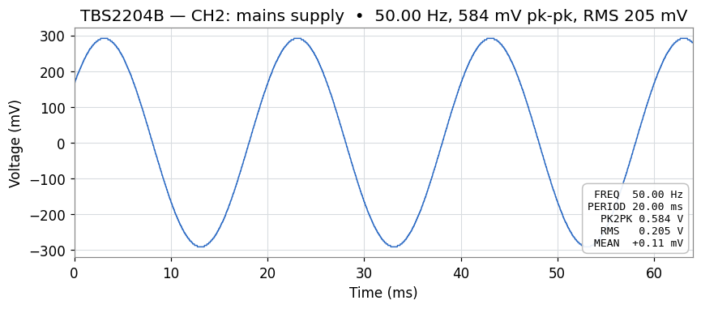
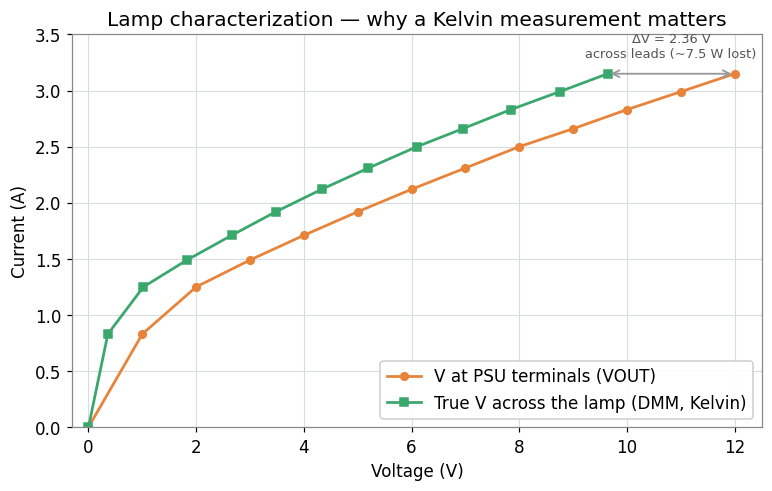
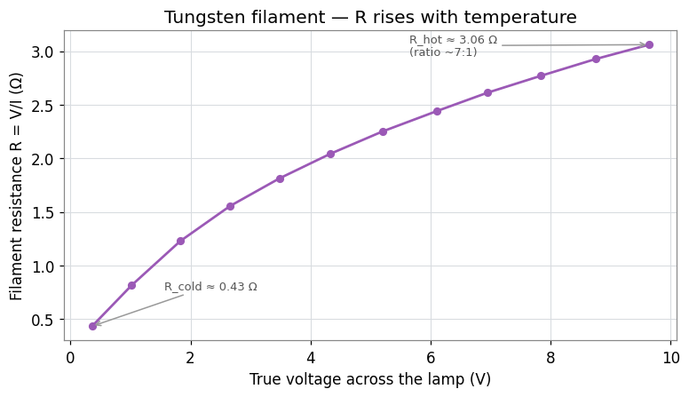

<div align="right">

**[🇮🇹 Italiano](./README.it.md) · 🇬🇧 English**

</div>

# MCP Instrumentation

[Model Context Protocol](https://modelcontextprotocol.io/) servers to drive lab instruments in natural language from an AI client (Claude Desktop, Claude Code, or any MCP client). Two separate benches, two transports, one philosophy: expose high-level operations as MCP *tools* (`measure`, `get_waveform`, `psu_set_voltage`, `psu_ramp_with_dmm`, ...) instead of leaving the AI to speak raw SCPI.

> Status: a lab project, running on real hardware. The measurements shown below are genuine acquisitions taken through these servers.

---

## Table of contents

- [What's inside](#whats-inside)
- [Architecture](#architecture)
- [Repository layout](#repository-layout)
- [Quick start](#quick-start)
- [Real-world examples](#real-world-examples)
  - [Oscilloscope: mains supply on CH2](#oscilloscope-mains-supply-on-ch2)
  - [HP bench: characterizing a lamp](#hp-bench-characterizing-a-lamp)
- [Documentation](#documentation)
- [Security](#security)
- [License](#license)

---

## What's inside

| Server | Instrument(s) | Physical transport | MCP transport | Docs |
|---|---|---|---|---|
| [`tbs2204b/`](./tbs2204b/) | Tektronix TBS2204B (oscilloscope) | Ethernet / LXI | stdio | [Guide](./tbs2204b/docs/guida_mcp_tbs2204b_windows.en.md) |
| [`hp-lab/`](./hp-lab/) | HP 6632A (PSU) · HP 6060B (e-load) · HP 5334B (counter) · HP 3457A (DMM) | GPIB (Contec board) | streamable-http | [Guide](./hp-lab/docs/guida_mcp_gpib_multistrumento.en.md) |

The two servers are independent: use one, both, or wire them into the same MCP-client session.

---

## Architecture

```
                         ┌────────────────────────┐
                         │ Claude Desktop / Code  │
                         │      (MCP client)      │
                         └──────────┬─────────────┘
                                    │ MCP (stdio or HTTP)
                ┌───────────────────┴───────────────────┐
                │                                       │
        ┌───────▼────────┐                     ┌────────▼─────────┐
        │ tbs2204b server│                     │  hp-lab server   │
        │  (stdio)       │                     │ (streamable-http)│
        │  pyvisa-py     │                     │  KI-VISA+Contec  │
        └───────┬────────┘                     └────────┬─────────┘
                │ TCP/IP (LXI)                          │ GPIB
        ┌───────▼────────┐        ┌──────────┬──────────┴─┬───────────┐
        │   TBS2204B     │   ┌────▼────┐ ┌───▼─────┐ ┌────▼────┐ ┌────▼─────┐
        │ 192.168.0.75   │   │HP 6632A │ │HP 6060B │ │HP 5334B │ │HP 3457A  │
        └────────────────┘   │  PSU    │ │ E-Load  │ │ Counter │ │  DMM     │
                             └─────────┘ └─────────┘ └─────────┘ └──────────┘
```

Design differences between the two servers:

| Aspect | `tbs2204b` | `hp-lab` |
|---|---|---|
| VISA backend | `pyvisa-py` (pure Python) | system KI-VISA |
| MCP transport | stdio (client subprocess) | streamable-http (network server, port 8000) |
| Startup | launched by the MCP client | Windows service (NSSM) on PC-LAB |
| Authentication | not needed (local) | optional bearer token |
| NumPy constraint | none | `numpy<2` (older PC-LAB CPUs) |
| Tool style | generic (`measure`, `get_waveform`, `scpi_*`) | per-instrument (`psu_*`, `load_*`, `counter_*`, `dmm_*`) |

---

## Repository layout

```
mcp-strumentazione/
├── README.md                  ← English (shown on the home page)
├── README.it.md               ← Italian
├── LICENSE
├── .gitignore
├── docs/
│   └── img/                   ← plots generated from lab data (IT + .en)
│       ├── scope_mains_ch2.en.png
│       ├── lamp_iv_psu_vs_dmm.en.png
│       └── lamp_resistance_vs_voltage.en.png
├── tbs2204b/
│   ├── README.md
│   ├── docs/
│   │   ├── guida_mcp_tbs2204b_windows.it.md
│   │   └── guida_mcp_tbs2204b_windows.en.md
│   ├── pyproject.toml
│   ├── server.py
│   ├── test_connessione.py
│   └── .env.example
├── hp-lab/
│   ├── README.md
│   ├── docs/
│   │   ├── guida_mcp_gpib_multistrumento.it.md
│   │   └── guida_mcp_gpib_multistrumento.en.md
│   ├── pyproject.toml
│   ├── server.py
│   ├── test_strumenti.py
│   └── .env.example
└── .github/
    └── workflows/lint.yml
```

---

## Quick start

Common prerequisites: **Windows 10/11**, **Python 3.10+**, **PowerShell**, an **MCP client** (Claude Desktop or Claude Code).

### Oscilloscope (`tbs2204b`)

```powershell
cd tbs2204b
python -m venv .venv
.\.venv\Scripts\Activate.ps1
pip install "mcp[cli]" pyvisa pyvisa-py numpy
$env:TBS2204B_IP = "192.168.0.75"   # the instrument's static IP in the lab
$env:TBS2204B_BACKEND = "py"
mcp dev .\server.py                  # test with the MCP Inspector
```

### HP bench (`hp-lab`)

```powershell
cd hp-lab
python -m venv .venv
.\.venv\Scripts\Activate.ps1
pip install "mcp[cli]" pyvisa "numpy<2" uvicorn   # NB: NOT pyvisa-py, NOT numpy>=2
$env:PSU_ADDR = "5"; $env:LOAD_ADDR = "6"; $env:COUNTER_ADDR = "14"
python .\server.py                                 # HTTP server on :8000
```

Full details (network/GPIB setup, firewall, client wiring, Windows service) are in each server's guides: [`tbs2204b/docs/`](./tbs2204b/docs/) and [`hp-lab/docs/`](./hp-lab/docs/).

---

## Real-world examples

Every measurement below was **actually** acquired through these servers, in lab sessions driven by Claude. The plots are reconstructed from the numerical data of those sessions.

### Oscilloscope: mains supply on CH2

A waveform acquired with `get_waveform(channel=2)` plus automatic measurements via `measure(...)` on the TBS2204B (S/N C021093, FW v1.32.147).



What the data shows:

- A round **50.00 Hz**, period **20.00 ms**: the mains supply (or a source PLL-locked to it).
- **584 mV peak-to-peak**, **205 mV RMS**. The RMS/PK2PK ratio of 0.351 lands within three thousandths of the theoretical value for a pure sine wave (1/(2√2) ≈ 0.354): no appreciable harmonic distortion.
- **DC mean +0.11 mV** against a ±292 mV span: pure AC, no offset.
- The ~4 mV vertical micro-steps are the instrument's **256 levels of the 8-bit ADC**, visible because the signal occupies roughly 146 of the 256 available levels at the scale used.

> Technical note that surfaced during development: the binary `RIBinary` transfer with `WIDth 2` on the TBS2200 had a byte-order inconsistency in the preamble. The server's fix is to read at `WIDth 1` (native 8-bit, no endianness) or in ASCII, removing any sign-extension ambiguity.

### HP bench: characterizing a lamp

A 0→12 V voltage ramp in 1 V steps via the HP 6632A PSU, with the **true** voltage at the lamp terminals measured simultaneously by the HP 3457A DMM (`psu_ramp_with_dmm` tool). This is the most instructive example in the project.



The two curves illustrate why a lab does a **Kelvin (4-wire) measurement**. At the same current, the voltage measured by the DMM at the lamp terminals (green) is systematically lower than what the PSU thinks it is delivering (orange), and the gap grows with current: it is exactly the I·R drop across the supply leads.

With the leads used in the first run:

| VSET | PSU VOUT | DMM (lamp) | ΔV leads | I | R_leads |
|---|---|---|---|---|---|
| 1 V | 1.000 V | 0.357 V | 0.64 V | 0.83 A | 0.77 Ω |
| 6 V | 6.004 V | 4.330 V | 1.67 V | 2.12 A | 0.79 Ω |
| 12 V | 11.995 V | **9.640 V** | **2.36 V** | 3.15 A | 0.75 Ω |

At 12 V set, ~7.5 W were dissipated as heat in the leads alone instead of in the lamp. Trusting the PSU's internal voltmeter only, one would have concluded "a 12 V / 37 W lamp, R_hot 3.8 Ω". The reality measured with the DMM: **9.6 V / 30 W, R_hot 3.06 Ω**.

Swapping the leads for thicker ones, the conductor resistance dropped from 0.76 Ω to **0.033 Ω** (23× lower), the ΔV at 12 V shrank to 0.11 V, and the lamp finally received 11.88 V, reaching its nominal regime (~42 W, R_hot 3.38 Ω — consistent with an **automotive H4/H7 bulb**).

#### The tungsten filament

Computing R = V/I from the true voltage reveals textbook tungsten behaviour: low resistance when cold, rising with temperature.



The R_hot/R_cold ratio measured with the **true** voltage is ~7:1, in line with the physics of tungsten. The same ratio computed from the PSU voltage gave ~3:1, skewed by the lead drop. A classic bench lesson: for accurate characterization, never trust the PSU's internal voltmeter when the leads are non-negligible.

> The `psu_ramp_with_dmm` tool runs the ramp with a server-side configurable dwell (so the timing is exact and independent of MCP latency) and records, at each step, both the PSU's `VOUT?`/`IOUT?` and the DMM reading. One call, one complete dataset ready to plot.

---

## Documentation

| Document | Contents |
|---|---|
| [TBS2204B guide](./tbs2204b/docs/guida_mcp_tbs2204b_windows.en.md) | Full setup of the oscilloscope server on Windows: network, VISA, server, wiring to Claude Desktop |
| [HP GPIB bench guide](./hp-lab/docs/guida_mcp_gpib_multistrumento.en.md) | Multi-instrument GPIB/Contec server: PSU + e-load + counter + DMM, HTTP transport, Windows service, security |

---

## Security

- **No secrets in the repo**: tokens, PATs and passwords live only in a local `.env` (gitignored). Examples go in `.env.example` with dummy values.
- **HP bench with no authentication = anyone on the LAN can command the instruments.** The PSU sources up to 100 W and the e-load sinks up to 300: an unauthorized connection can cause physical damage. On a closed lab LAN this is usually acceptable; otherwise enable the bearer token (`MCP_TOKEN`) and/or a reverse proxy with TLS. See the HP guide for details.
- **Server-side range validation**: every tool that sets voltages/currents rejects values outside the instrument's limits, reducing the risk of dangerous commands.

---

## License

See [LICENSE](./LICENSE).
