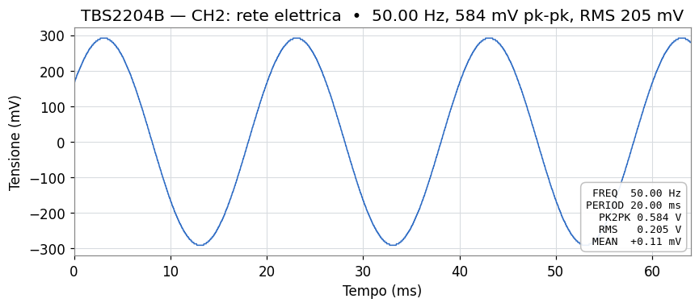
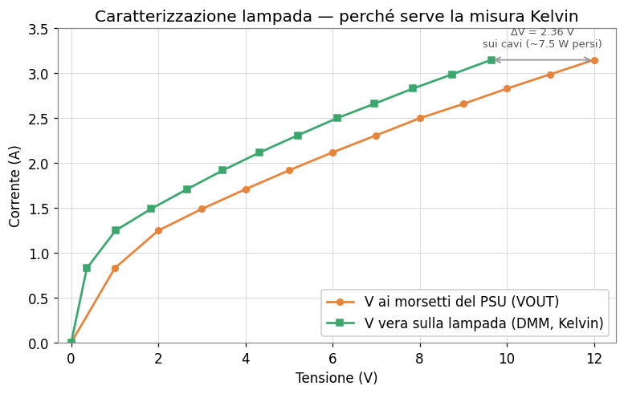
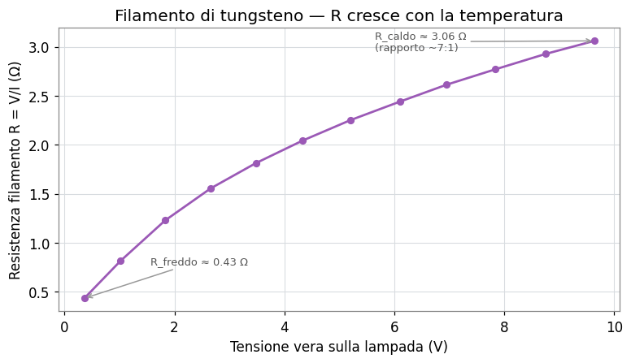

# MCP Strumentazione

Server [Model Context Protocol](https://modelcontextprotocol.io/) per controllare strumentazione di laboratorio in linguaggio naturale da un client AI (Claude Desktop, Claude Code, o qualsiasi client MCP). Due banchi distinti, due trasporti, un'unica filosofia: esporre come *tool* MCP operazioni di alto livello (`measure`, `get_waveform`, `psu_set_voltage`, `psu_ramp_with_dmm`, ...) invece di lasciare l'AI a parlare SCPI grezzo.

> Stato: progetto di laboratorio, funzionante su hardware reale. Le misure mostrate più sotto sono acquisizioni vere fatte attraverso questi server.

---

## Indice

- [Cosa c'è dentro](#cosa-cè-dentro)
- [Architettura](#architettura)
- [Struttura del repository](#struttura-del-repository)
- [Quick start](#quick-start)
- [Esempi reali](#esempi-reali)
  - [Oscilloscopio: rete elettrica su CH2](#oscilloscopio-rete-elettrica-su-ch2)
  - [Banco HP: caratterizzazione di una lampada](#banco-hp-caratterizzazione-di-una-lampada)
- [Documentazione](#documentazione)
- [Sicurezza](#sicurezza)
- [Licenza](#licenza)

---

## Cosa c'è dentro

| Server | Strumento/i | Trasporto fisico | Trasporto MCP | Doc |
|---|---|---|---|---|
| [`tbs2204b/`](./tbs2204b/) | Tektronix TBS2204B (oscilloscopio) | Ethernet / LXI | stdio | [Guida](./tbs2204b/docs/guida_mcp_tbs2204b_windows.md) |
| [`hp-lab/`](./hp-lab/) | HP 6632A (PSU) · HP 6060B (e-load) · HP 5334B (counter) | GPIB (scheda Contec) | streamable-http | [Guida](./hp-lab/docs/guida_mcp_gpib_multistrumento.md) |

I due server sono indipendenti: puoi usarne uno solo, entrambi, o collegarli nella stessa sessione di un client MCP.

---

## Architettura

```
                         ┌────────────────────────┐
                         │ Claude Desktop / Code  │
                         │      (client MCP)      │
                         └──────────┬─────────────┘
                                    │ MCP (stdio o HTTP)
                ┌───────────────────┴───────────────────┐
                │                                       │
        ┌───────▼────────┐                     ┌────────▼─────────┐
        │ Server tbs2204b│                     │  Server hp-lab   │
        │  (stdio)       │                     │ (streamable-http)│
        │  pyvisa-py     │                     │  KI-VISA+Contec  │
        └───────┬────────┘                     └────────┬─────────┘
                │ TCP/IP (LXI)                          │ GPIB
        ┌───────▼────────┐              ┌───────────────┼────────────┐
        │   TBS2204B     │       ┌──────▼──┐    ┌────────▼───┐ ┌──────▼────┐
        │ 192.168.0.75   │       │HP 6632A │    │ HP 6060B   │ │ HP 5334B  │
        └────────────────┘       │  PSU    │    │  E-Load    │ │  Counter  │
                                 └─────────┘    └────────────┘ └───────────┘
```

Differenze di progetto fra i due server:

| Aspetto | `tbs2204b` | `hp-lab` |
|---|---|---|
| Backend VISA | `pyvisa-py` (Python puro) | KI-VISA di sistema |
| Trasporto MCP | stdio (sottoprocesso del client) | streamable-http (server di rete, porta 8000) |
| Avvio | lanciato dal client MCP | servizio Windows (NSSM) su PC-LAB |
| Autenticazione | non necessaria (locale) | bearer token opzionale |
| Vincolo NumPy | nessuno | `numpy<2` (CPU vecchie del PC-LAB) |
| Stile dei tool | generici (`measure`, `get_waveform`, `scpi_*`) | per strumento (`psu_*`, `load_*`, `counter_*`) |

---

## Struttura del repository

```
mcp-strumentazione/
├── README.md                  ← questo file
├── LICENSE
├── .gitignore
├── docs/
│   ├── guida_mcp_tbs2204b_windows.md
│   ├── guida_mcp_gpib_multistrumento_V2.md
│   ├── guida_progetto_mcp_strumentazione_github.md
│   ├── guida_claude_code_setup.md
│   └── img/                   ← grafici generati dai dati di laboratorio
├── tbs2204b/
│   ├── README.md
│   ├── pyproject.toml
│   ├── server.py
│   ├── test_connessione.py
│   └── .env.example
├── hp-lab/
│   ├── README.md
│   ├── pyproject.toml
│   ├── server.py
│   ├── test_strumenti.py
│   └── .env.example
└── .github/
    └── workflows/lint.yml
```

---

## Quick start

Prerequisiti comuni: **Windows 10/11**, **Python 3.10+**, **PowerShell**, un **client MCP** (Claude Desktop o Claude Code).

### Oscilloscopio (`tbs2204b`)

```powershell
cd tbs2204b
python -m venv .venv
.\.venv\Scripts\Activate.ps1
pip install "mcp[cli]" pyvisa pyvisa-py numpy
$env:TBS2204B_IP = "192.168.0.75"   # IP statico dello strumento in lab
$env:TBS2204B_BACKEND = "py"
mcp dev .\server.py                  # test con MCP Inspector
```

### Banco HP (`hp-lab`)

```powershell
cd hp-lab
python -m venv .venv
.\.venv\Scripts\Activate.ps1
pip install "mcp[cli]" pyvisa "numpy<2" uvicorn   # NB: NON pyvisa-py, NON numpy>=2
$env:PSU_ADDR = "5"; $env:LOAD_ADDR = "6"; $env:COUNTER_ADDR = "14"
python .\server.py                                 # server HTTP su :8000
```

I dettagli completi (configurazione di rete/GPIB, firewall, collegamento al client, servizio Windows) sono nelle guide in [`docs/`](./docs/).

---

## Esempi reali

Tutte le misure qui sotto sono state acquisite **realmente** attraverso questi server, in sessioni di laboratorio guidate da Claude. I grafici sono ricostruiti dai dati numerici di quelle sessioni.

### Oscilloscopio: rete elettrica su CH2

Acquisizione di una forma d'onda con `get_waveform(channel=2)` e misure automatiche con `measure(...)` sul TBS2204B (S/N C021093, FW v1.32.147).



Cosa si legge nei dati:

- **50.00 Hz** tondi, periodo **20.00 ms**: rete elettrica (o sorgente agganciata in PLL alla rete).
- **584 mV picco-picco**, **RMS 205 mV**. Il rapporto RMS/PK2PK = 0.351 cade a meno di tre millesimi dal valore teorico di una sinusoide pura (1/(2√2) ≈ 0.354): nessuna distorsione armonica apprezzabile.
- **Media DC +0.11 mV** su ±292 mV di fondo: AC puro, nessun offset.
- I micro-gradini verticali da ~4 mV sono i **256 livelli dell'ADC a 8 bit** dello strumento, visibili perché il segnale occupa circa 146 dei 256 livelli disponibili sulla scala usata.

> Nota tecnica emersa durante lo sviluppo: il trasferimento binario `RIBinary` con `WIDth 2` sul TBS2200 presentava un'incongruenza di byte order nel preamble. La soluzione adottata nel server è leggere a `WIDth 1` (nativo 8-bit, niente endianness) o in ASCII, eliminando ogni ambiguità di sign-extension.

### Banco HP: caratterizzazione di una lampada

Rampa di tensione 0→12 V a passi da 1 V tramite il PSU HP 6632A, con misura simultanea della tensione **vera** ai morsetti della lampada tramite DVM (tool `psu_ramp_with_dmm`). Questo è l'esempio più istruttivo del progetto.



Le due curve raccontano perché in laboratorio si fa la **misura Kelvin** (4 fili). A parità di corrente, la tensione misurata dal DVM ai morsetti della lampada (verde) è sistematicamente più bassa di quella che il PSU crede di erogare (arancione), e il divario cresce con la corrente: è esattamente la caduta I·R sui cavi di alimentazione.

Con i cavi usati nella prima prova:

| VSET | PSU VOUT | DMM (lampada) | ΔV cavi | I | R_cavi |
|---|---|---|---|---|---|
| 1 V | 1.000 V | 0.357 V | 0.64 V | 0.83 A | 0.77 Ω |
| 6 V | 6.004 V | 4.330 V | 1.67 V | 2.12 A | 0.79 Ω |
| 12 V | 11.995 V | **9.640 V** | **2.36 V** | 3.15 A | 0.75 Ω |

A 12 V impostati, ~7.5 W finivano in calore sui soli cavi invece che nella lampada. Fidandosi del solo voltmetro interno del PSU si sarebbe concluso "lampada da 12 V / 37 W, R_caldo 3.8 Ω". La realtà misurata col DVM: **9.6 V / 30 W, R_caldo 3.06 Ω**.

Sostituendo i cavi con altri di sezione maggiore, la R dei conduttori è crollata da 0.76 Ω a **0.033 Ω** (23× più bassa), il ΔV a 12 V si è ridotto a 0.11 V e la lampada ha finalmente ricevuto 11.88 V, raggiungendo il regime nominale (~42 W, R_caldo 3.38 Ω — compatibile con una **lampada automotive H4/H7**).

#### Il filamento di tungsteno

Calcolando R = V/I dalla tensione vera, si vede il comportamento da manuale del tungsteno: resistenza bassa da freddo, crescente con la temperatura.



Il rapporto R_caldo/R_freddo misurato con la tensione **vera** è ~7:1, in linea con la fisica del tungsteno. Lo stesso rapporto calcolato sulla tensione del PSU dava ~3:1, falsato dalla caduta sui cavi. Lezione classica di banco: per caratterizzazioni accurate, mai fidarsi del voltmetro interno del PSU quando i cavi non sono trascurabili.

> Il tool `psu_ramp_with_dmm` esegue la rampa con dwell configurabile lato server (così il timing è esatto e indipendente dalla latenza MCP) e registra a ogni step sia `VOUT?`/`IOUT?` del PSU sia la lettura del DVM. Una chiamata, un dataset completo pronto per il grafico.

---

## Documentazione

| Documento | Contenuto |
|---|---|
| [Guida TBS2204B](./hp-lab/docs/guida_mcp_tbs2204b_windows.md) | Setup completo del server oscilloscopio su Windows: rete, VISA, server, collegamento a Claude Desktop |
| [Guida banco HP GPIB](./tbs2204b/docs/guida_mcp_gpib_multistrumento.md) | Server multi-strumento via GPIB Contec: PSU + e-load + counter, trasporto HTTP, servizio Windows, sicurezza |
| [Guida progetto + GitHub](./docs/guida_progetto_mcp_strumentazione_github.md) | Struttura del repo, `.gitignore`, licenza, pubblicazione e workflow git/GitHub |
| [Guida Claude Code](./docs/guida_claude_code_setup.md) | Installazione di Claude Code, GitHub MCP server, loop di sviluppo codice→commit→push |

---

## Sicurezza

- **Nessun segreto nel repo**: token, PAT e password vivono solo in `.env` locale (gitignored). Gli esempi vanno in `.env.example` con valori finti.
- **Banco HP senza autenticazione = chiunque sulla LAN può comandare gli strumenti.** Il PSU eroga fino a 100 W e l'e-load ne dissipa fino a 300: una connessione non autorizzata può fare danni fisici. In LAN di laboratorio chiusa è in genere accettabile; altrimenti attiva il bearer token (`MCP_TOKEN`) e/o un reverse proxy con TLS. Dettagli nella guida HP.
- **Validazione dei range** lato server: ogni tool che imposta tensioni/correnti rifiuta valori fuori dai limiti dello strumento, riducendo il rischio di comandi pericolosi.

---

## Licenza

Vedi [LICENSE](./LICENSE).
